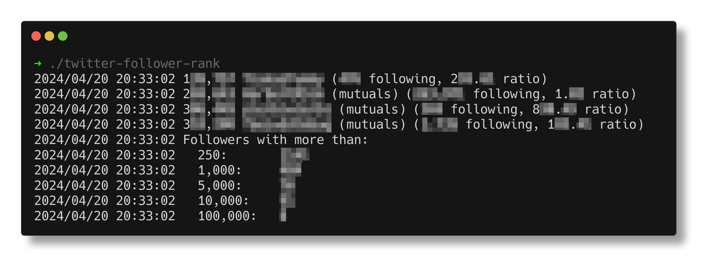
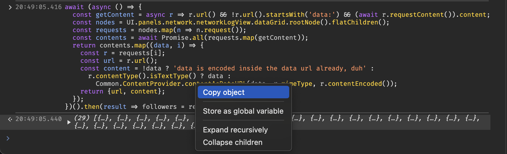

# twitter-follower-rank

#### A simple Go program to print a Twitter User's list of followers, sorted by number of followers.

> [!CAUTION]
> This does **not** use or require API access.
> Please read [disclaimer(s) section](#disclaimers) first.



> [!IMPORTANT]
> #### Pros
> - No $$$ API key
> - It just works
>
>#### Cons
> - Come up with some way to scroll down. I did it by hand.
> - After ~2k followers I got rate-limited with a 429 response. Go make some tea and come back.


## Usage

```bash
# Get repo && cd
git clone https://github.com/5HT2/twitter-follower-rank && cd twitter-follower-rank
```
```bash
# Build
make
# Once you have a data.json, run:
./twitter-follower-rank
# That's it!
```

<!-- GENERATED FROM MAKEFILE -->
```
Usage of ./twitter-follower-rank:
  -f string
        Data file to read (default "data.json" or matching "data-[0-9]{4}-[0-9]{2}-[0-9]{2}(-following)?.json")
  -following
        Invert mutuals detection mode to the following tab instead of the followers tab
  -maxFollowers int
        Filter to <= this many followers
  -maxFollowing int
        Filter to <= this many following
  -minFollowers int
        Filter to >= this many followers
  -minFollowing int
        Filter to >= this many following
  -ratio
        Only display followers with a following:follower ratio of >= -ratioBuf
  -ratioBuf float
        Buffer for ranked. e.g. If set to 0.9, it will display if (followers / following >= 0.9) (default 0.9)
```
<!-- GENERATED FROM MAKEFILE -->

### Auto select `data.json` file

<details><summary>An explanation of how automatically selecting a data file works:</summary>

---

The dates given here are **examples**, to show how the sort order works. It will use the first valid file that it finds.
- The flag `-f` is always prioritized as first, and is only ignored if the file cannot be read / does not exist.
- The `data.json` value is always **last** as a final fallback.
- The rest of the files are found from the existing files in the current working directory.

By default, the data file will by selected in this order:
```
my-custom-file.json (optionally set by -f)
data-2024-04-20.json
data-2024-03-01.json
data-2023-11-30.json
data.json
```

If you have the `-following` flag set it would instead look like this:
```
my-custom-file.json (optionally set by -f)
data-2024-04-20-following.json
data-2024-03-01-following.json
data.json
```

---

</details>

## What is a `data.json`

The way that this works is by leveraging Twitter's own Followers tab, and simply grabbing an object of all the requests.

In the future, I'll probably add a way to also do this via Twitter's GDPR data request, assuming it includes enough info to not have to scrape.

> [!TIP]
> TLDR:
> The `data.json` is created from the requests
> that your browser sends when loading a `/followers` or `/following` tab for a user profile.

## How to get your very own `data.json`

1. To do so, open the Chrome Dev Tools with <kbd>Ctrl</kbd> <kbd>Shift</kbd> <kbd>I</kbd>, go to the network tab.
2. In the network tab, search the text `Followers?`. This will filter it to only the requests we want.
3. Now, open the followers menu on Twitter, or visit https://[domain]/username/followers.
4. Scroll all the way to the bottom, just keep in mind that going too fast will rate-limit you. If you hit the limit, just wait 30min - 1h.
5. Once at the bottom, open a _new_ Dev Tools window for your existing Dev Tools window with <kbd>Ctrl</kbd> <kbd>Shift</kbd> <kbd>I</kbd> (yes, debug inception).
6. In the new Dev Tools window, open the console tab (taken from StackOverflow[^1][^2]), works on Chrome 118 or newer) and run the following:
> [!IMPORTANT]
> If you encounter an error complaining about `r.contentData()`, use the newer ≥ 118 version.[^3]
<details><summary><b>Chrome / Edge ≥ 118</b></summary>

```javascript
let followers = await (async () => {
  const getContent = r => r.url() && !r.url().startsWith('data:') && r.contentData();
  const nodes = UI.panels.network.networkLogView.dataGrid.rootNode().flatChildren();
  const requests = nodes.map(n => n.request());
  const contents = await Promise.all(requests.map(getContent));
  return contents.map((data, i) => {
    const r = requests[i];
    const url = r.url();
    const body = data?.content;
    const content = !data ? url :
        r.contentType().isTextType() ? data :
            typeof body !== 'string' ? body :
                `data:${r.mimeType}${data.encoded ? ';base64' : ''},${body}`;
    return { url, content };
  });
})();
```
</details>
<details><summary><b>Chrome / Edge ≥ 111 ≤ 117</b></summary>

  ```javascript
  let followers = await (async () => {
  const getContent = r => r.url() && !r.url().startsWith('data:') && r.contentData();
  const nodes = UI.panels.network.networkLogView.dataGrid.rootNode().flatChildren();
  const requests = nodes.map(n => n.request());
  const contents = await Promise.all(requests.map(getContent));
  return contents.map((data, i) => {
  const r = requests[i];
  const url = r.url();
  const body = data?.content;
  const content = !data ? url :
  r.contentType().isTextType() ? data :
  typeof body !== 'string' ? body :
  `data:${r.mimeType}${data.encoded ? ';base64' : ''},${body}`;
  return { url, content };
  });
  })();
  ```
</details>
7. Once you've scrolled all the way to the bottom, <kbd>Right Click</kbd> → <kbd>"Copy Object"</kbd> on the output of the last console command.

8. Congrats! Now you can create a file called `data.json` inside this project, and paste the JSON object into it.

## Using the `data.json`
> [!TIP]
> The program itself handles all the parsing and such from that point.
> Please see [the usage section](#usage) for a list of program flags, the simplest arguments are as follows:
> ```shell
> # You can even omit the -f flag, as it will auto-select the file for you.
> ./twitter-follower-rank -f data.json
> ```

---

#### Patch workaround
> [!NOTE]
> Twitter attempted to patch this (multiple times).
> - As of 2024/03, Twitter switched from `followers[n].content.content` to `followers[n].content.#g`.<br>
> - As of 2024/04, Twitter switched from `followers[n].content.#g` to `followers[n].content.#e`.
> - As of 2024/12, Twitter switched from `followers[n].content.#e` to `followers[n].content`.

> [!TIP]
> **The patch is currently __unnecessary__!!**
> 
> As of fbf4d3024a2f20509e40baf95ae79693c4fbd499 it is automagically supported.

<details><summary>Patch workaround (currently unnecessary)</summary>

This is annoying, as it means the Chrome Dev tools don't include the final `.content` when doing "Copy Object", *but* there is a workaround.
There's a `fix-chrome-private-field.applescript` script which you can run with `osascript fix-chrome-private-field.applescript [number of items]`.

The script essentially just types out `followers[n].content.content = followers[n].content.#e` incrementally and increases `n`. You can't do this in a for loop in Chrome for some reason, as it will give you a private field access error.

If you'd like a Linux version of the script, or know how to get around Chrome not allowing accessing private fields in a for loop, feel free to open an issue or message me (my contact info is listed on [my profile](https://github.com/5HT2)).

</details>

---

## Disclaimer(s)

1. I have no idea if Twitter will care if you scroll down to the bottom of the followers tab, I'd advise you to tread with caution though.
2. This code was incredibly hastily written, it's kind of awful, easy to improve but it works, I don't care enough to bother. It does what I need it to.
3. This might break if the response format changes. Unlikely, but feel free to make a Github issue about it.
4. This data appears to be kind of cached on the server, if someone changes their username the old one is still sent in a response (multiple weeks after the username change). There's no error checking for empty profiles either.
For the most part, it's functional, with the rare 1 or 2 duplicate accounts, the follower counts might also be a lil outdated, this is just Twitter's caching / optimization stuff on their end.
5. Idk this is really janky, if it breaks or there's something you want me to fix, feel free to ask lol

[^1]: https://stackoverflow.com/a/57782978 (Chrome JS code >= 111 <= 117)
[^2]: https://stackoverflow.com/a/78999261 (Chrome JS code >= 118)
[^3]: [Chromium `third_party/devtools-frontend` API change for `requestData()`](https://source.chromium.org/chromium/_/chromium/devtools/devtools-frontend/+/0d87db62760f96b8efe54bb6a97c3450b372bb74:front_end/core/sdk/NetworkRequest.ts;dlc=37ae2d25449c0b76cb5559f60460707fee5e01b5)
  